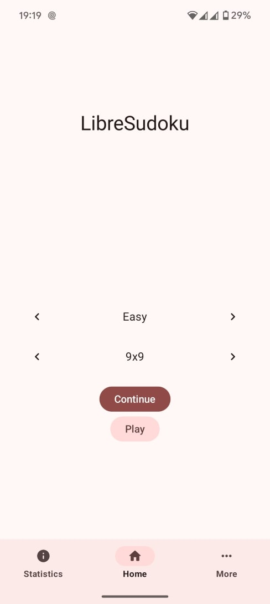
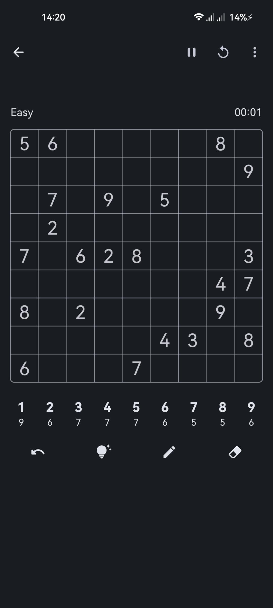
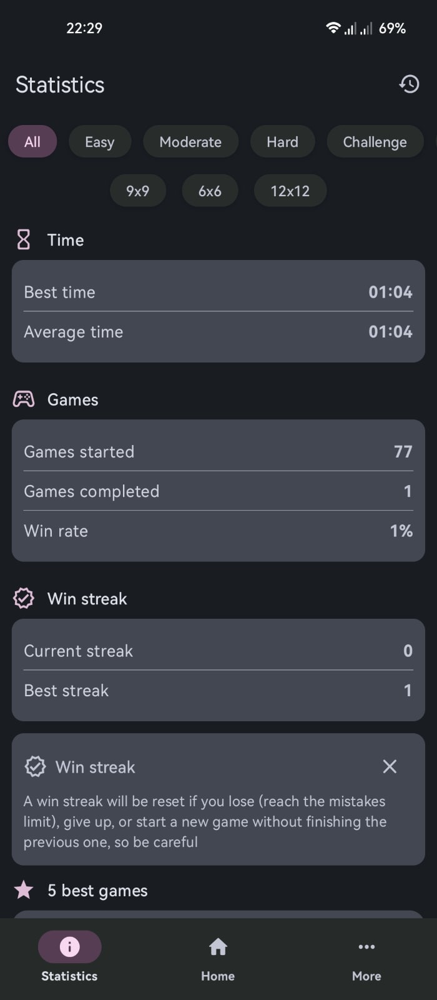
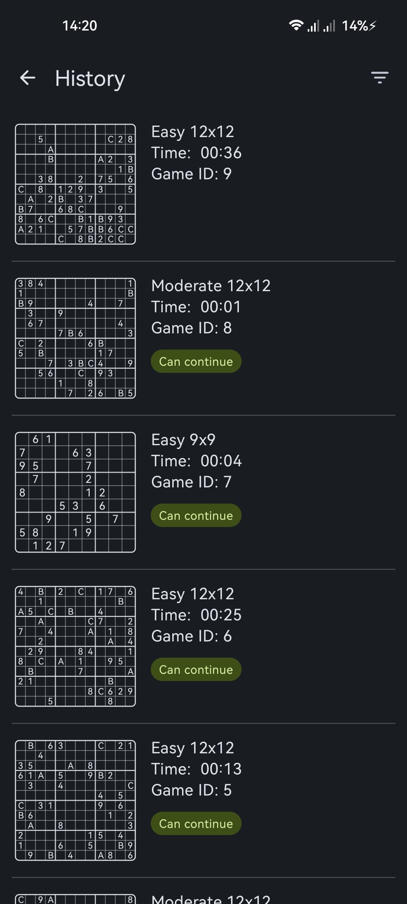
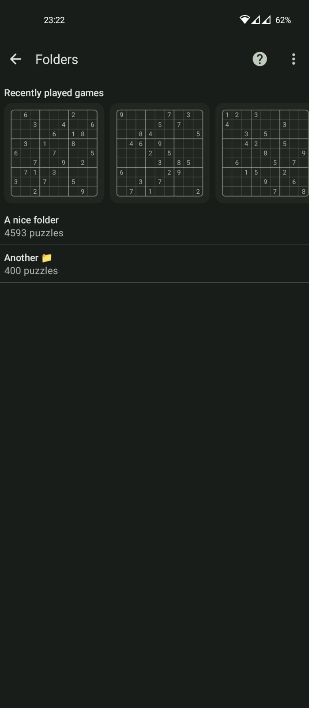
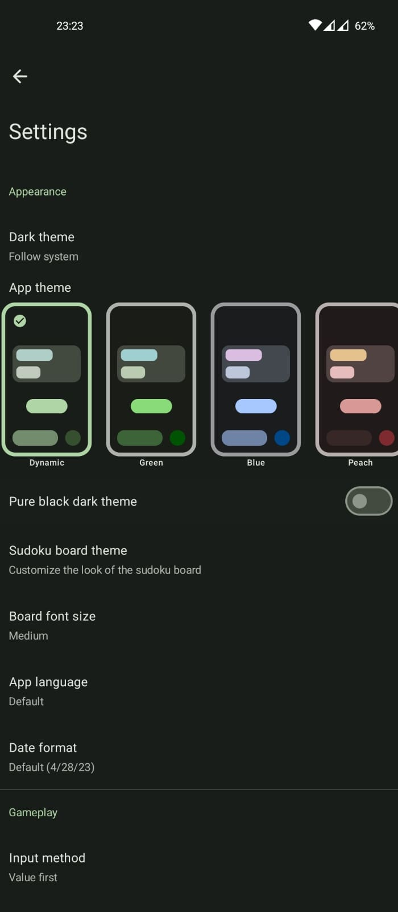

# Libre-Sudoku

  
  

  
  
  
  

  
  
  
  <a href="https://www.rustore.ru/catalog/app/com.kaajjo.libresudoku">
    

Open Source sudoku application designed to be as user friendly and customizable as possible \
Built with [Jetpack Compose](https://developer.android.com/jetpack/compose) and [Material3](https://m3.material.io/)

## 📱 Screenshots 

  
  
  
  
  
  

## 💡 Features
- 6x6, 9x9, and 12x12 sudoku boards with 4 difficulty levels
- Countless customization options
- Advanced statistics and game history - previous games list, best and average times for each mode, win streak and percentage
- Saves. You can continue any unfinished game and start a new one whenever you want
- Tutorials for playing techniques
- Create your own sudoku puzzles!
- Import custom sudoku files

## FOSS vs nonFOSS
### nonFOSS 
#### It comes with auto updater that will notify you when a new update is available and you can install it through the app (it checks GitHub Releases page), and requires the specified permissions to do so:
- `<uses-permission android:name="android.permission.INTERNET"/>`
- `<uses-permission android:name="android.permission.ACCESS_NETWORK_STATE"/>`
- `<uses-permission android:name="android.permission.MANAGE_EXTERNAL_STORAGE"/>`
- `<uses-permission android:name="android.permission.REQUEST_INSTALL_PACKAGES"/>`

([nonFOSS AndroidManifest.xml](https://github.com/kaajjo/LibreSudoku/blob/main/app/src/nonFOSS/AndroidManifest.xml))
### FOSS
Does not have internet access and does not request any permissions.

([FOSS AndroidManifest.xml](https://github.com/kaajjo/LibreSudoku/blob/main/app/src/foss/AndroidManifest.xml))

## Future plans
- Better hint system (explain the next move instead of just revealing the value)
- Complete set of sudoku technique tutorials
- Custom sudoku from gallery or camera picture
- More customization options (customize anything that can be customized🔥)

## 🌍 Translation
You can help to translate LibreSudoku into your language at [Hosted Weblate](https://hosted.weblate.org/engage/libresudoku/)\

## Credits
This project uses a modified version of [QQWing](https://github.com/stephenostermiller/qqwing) - sudoku puzzle generator and solver\

† [Tachiyomi](https://github.com/tachiyomiorg/tachiyomi)

[Seal](https://github.com/JunkFood02/Seal)

[Open Sudoku](https://gitlab.com/opensudoku/opensudoku)

[Privacy Friendly Sudoku](https://github.com/SecUSo/privacy-friendly-sudoku)

## License

